# InfraCore 🚀

<div align="center">

**企业级基础设施管理平台 - 现代化、安全、高效**

[](https://github.com/Last-emo-boy/infra-core/releases)
[](https://golang.org/)
[](https://nodejs.org/)
[](https://www.docker.com/)

[](https://github.com/Last-emo-boy/infra-core/actions)
[](https://codecov.io/gh/Last-emo-boy/infra-core)
[](https://goreportcard.com/report/github.com/Last-emo-boy/infra-core)
[](https://snyk.io/test/github/Last-emo-boy/infra-core)

[](https://github.com/Last-emo-boy/infra-core/blob/main/LICENSE)
[](https://github.com/Last-emo-boy/infra-core/issues)
[](https://github.com/Last-emo-boy/infra-core/pulls)
[](https://github.com/Last-emo-boy/infra-core/stargazers)

[](https://wakatime.com/badge/user/5bd3393a-a3b1-48aa-90a2-bcf1f6bfcb7f/project/58091149-5978-444c-8aba-dc8c8ef8f045)

[](https://github.com/Last-emo-boy/infra-core/graphs/contributors)
[](https://github.com/Last-emo-boy/infra-core/commits/main)
[](https://github.com/Last-emo-boy/infra-core)

[](https://www.typescriptlang.org/)
[](https://reactjs.org/)
[](https://tailwindcss.com/)
[](https://vitejs.dev/)

</div>

---

## 📖 项目简介

InfraCore 是一个现代化的企业级基础设施管理平台，专为中小企业和个人开发者设计。它提供了 Web 控制台、反向代理网关和多环境支持等核心功能，让基础设施管理变得简单高效。

**项目作者**: [last-emo-boy](https://github.com/last-emo-boy)  
**当前版本**: v1.0.0  
**开发语言**: Go + TypeScript  
**前端框架**: React 18 + Vite  

## ✨ 核心特性

| 功能模块 | 描述 | 状态 |
|---------|------|------|
| 🌐 **智能网关** | HTTP/HTTPS 反向代理，支持 ACME 自动证书 | ✅ 完成 |
| 📊 **管理控制台** | React 现代化 Web 界面，响应式设计 | ✅ 完成 |
| 🔐 **安全认证** | JWT 令牌认证，基于角色的权限控制 | ✅ 完成 |
| 🐳 **容器管理** | Docker 服务生命周期管理 | ✅ 完成 |
| 🔧 **多环境支持** | 开发、测试、生产环境配置隔离 | ✅ 完成 |
| 🚀 **一键部署** | Docker Compose 和传统部署方案 | ✅ 完成 |
| 📈 **实时监控** | 系统指标监控和健康检查 | ✅ 完成 |
| 🎨 **主题切换** | 深色/浅色主题，用户体验优化 | 🚧 开发中 |
| 🌍 **国际化** | 中英文双语支持 | 📋 计划中 |
| 📱 **移动端适配** | PWA 支持，移动端友好界面 | 📋 计划中 |

## 🏗️ 系统架构

```mermaid
graph TB
    A[用户浏览器] --> B[反向代理网关<br/>Gate :80/443]
    B --> C[Web 控制台<br/>React UI :5173]
    B --> D[API 服务器<br/>Console :8082]
    D --> E[SQLite 数据库]
    D --> F[配置文件<br/>YAML]
    D --> G[Docker 引擎]
    
    subgraph "安全层"
        H[JWT 认证]
        I[RBAC 权限]
        J[HTTPS/TLS]
    end
    
    B --> H
    D --> H
    D --> I
    B --> J
    
    style A fill:#e1f5fe
    style B fill:#f3e5f5
    style C fill:#e8f5e8
    style D fill:#fff3e0
    style E fill:#fce4ec
```



## 🚀 快速开始

### 🔧 环境要求

| 组件 | 版本要求 | 用途 |
|------|----------|------|
|  | **Go 1.24.5+** | 后端服务开发 |
|  | **Node.js 20+** | 前端构建工具 |
|  | **Docker & Docker Compose** | 容器化部署 |
|  | **GNU Make** | 构建自动化（可选） |

### 📦 克隆项目

```bash
# 使用 HTTPS
git clone https://github.com/last-emo-boy/infra-core.git

# 使用 SSH（推荐）
git clone git@github.com:last-emo-boy/infra-core.git

# 进入项目目录
cd infra-core
```

### 🔨 开发环境

```bash
# 方式一：使用 Make（推荐）
make install-deps    # 安装依赖
make dev            # 启动开发环境

# 方式二：手动启动
# 后端服务
INFRA_CORE_ENV=development go run cmd/console/main.go

# 前端服务（新终端）
cd ui && npm install && npm run dev
```

### 🏭 生产部署

#### 🐳 Docker 部署（推荐）

```bash
# Linux/macOS 一键部署
./deploy.sh production

# Windows PowerShell 部署
.\deploy.ps1 -Environment production

# 使用 Make 部署
make prod

# 自定义 Docker Compose 部署
docker-compose -f docker-compose.yml up -d
```

#### 📦 手动构建部署

```bash
# 构建所有组件
make build-all

# 配置环境变量
export INFRA_CORE_ENV=production
export INFRA_CORE_JWT_SECRET=$(openssl rand -hex 32)

# 启动服务
./bin/console
```

## 📁 项目结构

<details>
<summary>点击查看详细目录结构 📂</summary>

```
infra-core/                           # 项目根目录
├── 📁 cmd/                          # 应用程序入口点
│   ├── 📁 console/                  # 控制台 API 服务器
│   │   └── main.go                  # 主服务入口
│   ├── 📁 gate/                     # 反向代理网关
│   │   └── main.go                  # 网关入口
│   ├── 📁 api-test/                 # API 测试工具
│   └── 📁 db-test/                  # 数据库测试工具
├── 📁 pkg/                          # 共享库和包
│   ├── 📁 api/                      # API 处理器和中间件
│   │   ├── 📁 handlers/             # 路由处理器
│   │   ├── 📁 middleware/           # 中间件
│   │   └── 📁 routes/               # 路由定义
│   ├── 📁 auth/                     # 认证服务
│   ├── 📁 config/                   # 配置管理
│   ├── 📁 database/                 # 数据库层
│   ├── 📁 acme/                     # ACME 证书管理
│   └── 📁 proxy/                    # 反向代理逻辑
├── 📁 ui/                           # React 前端应用
│   ├── 📁 src/                      # 源代码
│   │   ├── 📁 components/           # React 组件
│   │   ├── 📁 pages/                # 页面组件
│   │   ├── 📁 contexts/             # React 上下文
│   │   ├── 📁 hooks/                # 自定义 Hook
│   │   ├── 📁 types/                # TypeScript 类型定义
│   │   └── 📁 utils/                # 工具函数
│   ├── 📁 public/                   # 静态资源
│   ├── 📁 dist/                     # 构建输出
│   ├── package.json                 # 前端依赖配置
│   ├── vite.config.ts              # Vite 配置
│   ├── tailwind.config.js          # Tailwind CSS 配置
│   └── tsconfig.json               # TypeScript 配置
├── 📁 configs/                      # 环境配置文件
│   ├── development.yaml             # 开发环境配置
│   ├── production.yaml              # 生产环境配置
│   └── testing.yaml                 # 测试环境配置
├── 📁 .github/                      # GitHub Actions
│   └── 📁 workflows/                # CI/CD 工作流
│       ├── ci.yml                   # 持续集成
│       └── deploy.yml               # 自动部署
├── 📁 scripts/                      # 脚本文件
├── 📁 docs/                         # 文档目录
├── 🐳 docker-compose.yml            # 生产环境 Docker
├── 🐳 docker-compose.dev.yml        # 开发环境 Docker
├── 🐳 Dockerfile                    # 生产镜像构建
├── 🐳 Dockerfile.dev                # 开发镜像构建
├── 🚀 deploy.sh                     # Linux 部署脚本
├── 🚀 deploy.ps1                    # Windows 部署脚本
├── 🔧 Makefile                      # 构建自动化
├── 📄 go.mod                        # Go 模块定义
├── 📄 go.sum                        # Go 依赖校验
├── 📄 .gitignore                    # Git 忽略规则
└── 📖 README.md                     # 项目说明文档
```

</details>

## ⚙️ 配置说明

### 🔧 环境配置

项目支持多环境配置，每个环境都有独立的配置文件：

| 环境 | 配置文件 | 用途 | 特点 |
|------|----------|------|------|
| 🔬 **开发环境** | `configs/development.yaml` | 本地开发调试 | 详细日志、热重载 |
| 🧪 **测试环境** | `configs/testing.yaml` | 自动化测试 | 模拟数据、快速响应 |
| 🏭 **生产环境** | `configs/production.yaml` | 正式部署 | 性能优化、安全加固 |

### 🌍 环境变量

<details>
<summary>查看完整环境变量配置 ⚙️</summary>

```bash
# 🔧 核心配置
INFRA_CORE_ENV=development               # 运行环境
INFRA_CORE_JWT_SECRET=your-secret-key    # JWT 密钥
INFRA_CORE_CONSOLE_PORT=8082             # API 服务端口

# 💾 数据库配置
INFRA_CORE_DB_PATH=/path/to/database.db  # SQLite 数据库路径

# 🔒 ACME/SSL 配置
INFRA_CORE_ACME_EMAIL=admin@example.com  # ACME 邮箱
INFRA_CORE_ACME_ENABLED=true             # 启用 ACME

# 🌐 网关配置
INFRA_CORE_GATE_HTTP_PORT=80             # HTTP 端口
INFRA_CORE_GATE_HTTPS_PORT=443           # HTTPS 端口

# 📊 监控配置
INFRA_CORE_METRICS_ENABLED=true          # 启用指标监控
INFRA_CORE_LOG_LEVEL=info                # 日志级别
```

</details>

## 🌐 API 接口文档

### 🔐 认证接口

| 方法 | 路径 | 描述 | 权限 |
|------|------|------|------|
| `POST` | `/api/v1/auth/login` | 用户登录 | 公开 |
| `POST` | `/api/v1/auth/register` | 用户注册 | 公开 |
| `POST` | `/api/v1/auth/logout` | 用户退出 | 已认证 |
| `POST` | `/api/v1/auth/refresh` | 刷新令牌 | 已认证 |

### 👥 用户管理

| 方法 | 路径 | 描述 | 权限 |
|------|------|------|------|
| `GET` | `/api/v1/users/profile` | 获取用户资料 | 已认证 |
| `PUT` | `/api/v1/users/profile` | 更新用户资料 | 已认证 |
| `GET` | `/api/v1/users` | 用户列表 | 管理员 |
| `PUT` | `/api/v1/users/:id` | 更新用户 | 管理员 |
| `DELETE` | `/api/v1/users/:id` | 删除用户 | 管理员 |

### 🐳 服务管理

| 方法 | 路径 | 描述 | 权限 |
|------|------|------|------|
| `GET` | `/api/v1/services` | 服务列表 | 已认证 |
| `POST` | `/api/v1/services` | 创建服务 | 管理员 |
| `GET` | `/api/v1/services/:id` | 服务详情 | 已认证 |
| `PUT` | `/api/v1/services/:id` | 更新服务 | 管理员 |
| `DELETE` | `/api/v1/services/:id` | 删除服务 | 管理员 |
| `POST` | `/api/v1/services/:id/start` | 启动服务 | 管理员 |
| `POST` | `/api/v1/services/:id/stop` | 停止服务 | 管理员 |
| `GET` | `/api/v1/services/:id/logs` | 服务日志 | 已认证 |

### 📊 系统监控

| 方法 | 路径 | 描述 | 权限 |
|------|------|------|------|
| `GET` | `/api/v1/system/info` | 系统信息 | 已认证 |
| `GET` | `/api/v1/system/metrics` | 系统指标 | 已认证 |
| `GET` | `/api/v1/system/dashboard` | 仪表板数据 | 已认证 |
| `GET` | `/api/v1/health` | 健康检查 | 公开 |

## 🔧 开发指南

### 📦 构建命令

```bash
# 📋 查看所有可用命令
make help

# 🔨 仅构建后端
make build

# 🎨 仅构建前端
make build-ui

# 🚀 构建所有组件
make build-all

# 🧪 运行测试
make test

# 🔌 测试 API 接口
make test-api

# 🧹 清理构建产物
make clean

# 📊 代码质量检查
make lint

# 📈 生成代码覆盖率报告
make coverage
```

### 🔄 开发工作流

```bash
# 🚀 启动开发环境
make dev

# 📋 查看服务日志
make logs

# ❓ 检查服务状态
make status

# 🔄 重启服务
make restart

# ⏹️ 停止服务
make stop

# 🧪 运行端到端测试
make test-e2e
```

### 🎨 前端开发

```bash
cd ui

# 📦 安装依赖
npm install

# 🚀 启动开发服务器
npm run dev

# 🏗️ 构建生产版本
npm run build

# 🔍 类型检查
npm run type-check

# 🧪 运行单元测试
npm run test

# 🎨 代码格式化
npm run format

# 📊 Bundle 分析
npm run analyze
```

## ✅ 安装验证与测试

### 🧪 快速验证安装

安装完成后，按照以下步骤验证系统是否正常运行：

#### 1. 🔍 检查服务状态

```bash
# 使用部署脚本检查状态
sudo ./server-deploy.sh --status

# 或者手动检查 Docker 服务
docker-compose ps

# 查看服务日志
docker-compose logs -f
```

预期输出示例：
```
✅ InfraCore Status Report
━━━━━━━━━━━━━━━━━━━━━━━━━━━━━━━━━━━━━━━━━━━━━━━━━━━━━━━━━━━━━━━━━━━━━━━━
🐳 Docker Services Status:
  • infra-core_gate_1     ✅ Up (healthy) - 0.0.0.0:80->80/tcp, 0.0.0.0:443->443/tcp
  • infra-core_console_1  ✅ Up (healthy) - 0.0.0.0:8082->8082/tcp
  • infra-core_ui_1       ✅ Up (healthy) - 0.0.0.0:5173->5173/tcp

📊 System Resources:
  • CPU Usage: 15.2%
  • Memory Usage: 1.2GB / 8GB (15%)
  • Disk Usage: 2.3GB / 100GB (2.3%)

🌐 Network Endpoints:
  • Web Console: http://localhost (or your-domain.com)
  • API Server:  http://localhost:8082
  • UI Dev Server: http://localhost:5173 (if in dev mode)
```

#### 2. 🌐 Web 界面测试

打开浏览器访问以下地址：

| 服务 | 地址 | 预期结果 |
|------|------|----------|
| **主界面** | `http://localhost` 或 `http://your-domain.com` | 显示登录页面 |
| **API 健康检查** | `http://localhost:8082/api/v1/health` | 返回 JSON 健康状态 |
| **开发环境 UI** | `http://localhost:5173` | React 开发服务器界面 |

#### 3. � 登录功能测试

```bash
# 测试默认管理员登录
curl -X POST http://localhost:8082/api/v1/auth/login \
  -H "Content-Type: application/json" \
  -d '{"username":"admin","password":"admin123"}'
```

成功响应示例：
```json
{
  "success": true,
  "data": {
    "token": "eyJhbGciOiJIUzI1NiIsInR5cCI6IkpXVCJ9...",
    "user": {
      "id": 1,
      "username": "admin",
      "role": "admin",
      "created_at": "2025-01-01T00:00:00Z"
    }
  },
  "message": "Login successful"
}
```

#### 4. 📊 API 接口测试

```bash
# 获取 JWT 令牌（从上一步获取）
TOKEN="your-jwt-token-here"

# 测试用户信息接口
curl -X GET http://localhost:8082/api/v1/users/profile \
  -H "Authorization: Bearer $TOKEN"

# 测试系统信息接口
curl -X GET http://localhost:8082/api/v1/system/info \
  -H "Authorization: Bearer $TOKEN"

# 测试服务列表接口
curl -X GET http://localhost:8082/api/v1/services \
  -H "Authorization: Bearer $TOKEN"
```

### 🔧 镜像速度测试

在部署前，可以测试网络环境下最快的镜像源：

```bash
# 测试所有镜像源的速度
sudo ./server-deploy.sh --test-mirrors
```

预期输出示例：
```
🧪 Testing mirror speeds to find the fastest available options...

📦 Testing Alpine package mirrors...
Testing 清华大学 (https://mirrors.tuna.tsinghua.edu.cn/alpine)...
  ✅ 清华大学: 0.245s
Testing 中科大 (https://mirrors.ustc.edu.cn/alpine)...
  ✅ 中科大: 0.389s
Testing 官方CDN (https://dl-cdn.alpinelinux.org/alpine)...
  ❌ 官方CDN: Connection failed

🔧 Testing Go module proxies...
Testing 七牛云 (https://goproxy.cn)...
  ✅ 七牛云: 0.156s
Testing goproxy.io (https://goproxy.io)...
  ✅ goproxy.io: 0.298s

📦 Testing NPM registries...
Testing 淘宝镜像 (https://registry.npmmirror.com)...
  ✅ 淘宝镜像: 0.298s
Testing 官方源 (https://registry.npmjs.org)...
  ✅ 官方源: 1.234s

🚀 Optimized configuration selected:
  • Alpine packages: 清华大学 (https://mirrors.tuna.tsinghua.edu.cn/alpine)
  • Go modules: 七牛云 (https://goproxy.cn,direct)
  • NPM packages: 淘宝镜像 (https://registry.npmmirror.com/)
```

### 🚀 完整部署测试

#### 使用智能镜像部署：

```bash
# 生产环境部署（推荐中国用户）
sudo ./server-deploy.sh --mirror

# 交互式升级部署
sudo ./server-deploy.sh --upgrade --mirror

# 自定义区域镜像
sudo ./server-deploy.sh --mirror cn  # 中国镜像
sudo ./server-deploy.sh --mirror us  # 美国镜像
```

#### 部署成功验证清单：

- [ ] ✅ Docker 容器全部启动且状态为 `healthy`
- [ ] ✅ Web 界面可正常访问（http://localhost）
- [ ] ✅ API 健康检查返回正常状态
- [ ] ✅ 管理员账户可正常登录
- [ ] ✅ 系统信息页面显示正确数据
- [ ] ✅ 服务管理功能正常工作
- [ ] ✅ 日志查看功能正常

### 🐛 常见问题排查

#### 1. 端口占用问题

```bash
# 检查端口占用
sudo netstat -tlnp | grep -E ':80|:443|:8082|:5173'

# 或使用 ss 命令
sudo ss -tlnp | grep -E ':80|:443|:8082|:5173'

# 解决方案：修改配置文件或停止冲突服务
sudo systemctl stop apache2 nginx  # 停止可能冲突的 Web 服务
```

#### 2. Docker 服务异常

```bash
# 查看详细错误日志
docker-compose logs --tail=50 infra-core

# 重启单个服务
docker-compose restart console

# 重建并启动服务
docker-compose up -d --force-recreate --build
```

#### 3. 权限问题

```bash
# 检查部署目录权限
ls -la /opt/infra-core/

# 修复权限（如果需要）
sudo chown -R infracore:infracore /opt/infra-core/
sudo chmod -R 755 /opt/infra-core/
```

#### 4. 网络连接问题

```bash
# 测试内部网络连通性
docker-compose exec console ping gate
docker-compose exec gate ping console

# 检查防火墙设置
sudo ufw status
sudo firewall-cmd --list-all  # CentOS/RHEL
```

#### 5. SSL/HTTPS 证书问题

```bash
# 检查证书状态
docker-compose exec gate ls -la /data/acme/

# 手动申请证书
docker-compose exec gate certbot certonly --standalone -d your-domain.com

# 查看证书日志
docker-compose logs gate | grep -i cert
```

### 📊 性能基准测试

#### 基本性能测试：

```bash
# API 响应时间测试
curl -w "@curl-format.txt" -o /dev/null -s http://localhost:8082/api/v1/health

# 创建 curl-format.txt 文件
cat > curl-format.txt << 'EOF'
     time_namelookup:  %{time_namelookup}\n
        time_connect:  %{time_connect}\n
     time_appconnect:  %{time_appconnect}\n
    time_pretransfer:  %{time_pretransfer}\n
       time_redirect:  %{time_redirect}\n
  time_starttransfer:  %{time_starttransfer}\n
                     ----------\n
          time_total:  %{time_total}\n
EOF
```

#### 负载测试（可选）：

```bash
# 使用 Apache Bench 进行负载测试
ab -n 1000 -c 10 http://localhost:8082/api/v1/health

# 使用 wrk 进行更复杂的负载测试
wrk -t12 -c400 -d30s http://localhost:8082/api/v1/health
```

### 🔄 升级和维护测试

```bash
# 测试配置重载
sudo ./server-deploy.sh --restart

# 测试备份功能
sudo ./server-deploy.sh --backup

# 测试回滚功能
sudo ./server-deploy.sh --rollback

# 查看系统健康状况
sudo ./server-deploy.sh --health-check
```

## �🚀 部署指南

### 🐳 Docker 部署

#### 生产环境部署

```bash
# 🚀 一键部署到生产环境（推荐）
sudo ./server-deploy.sh --mirror

# 🔧 或者使用自定义配置
docker-compose -f docker-compose.yml up -d

# 📊 查看服务状态
docker-compose ps

# 📋 查看日志
docker-compose logs -f
```

#### 开发环境部署

```bash
# 🔧 启动开发环境
docker-compose -f docker-compose.dev.yml up -d

# 🔄 重建并启动
docker-compose -f docker-compose.dev.yml up --build -d
```

### 📦 手动部署

#### Linux 服务器部署

```bash
# 👤 创建系统用户
sudo useradd -r -s /bin/false infracore

# 📁 创建必要目录
sudo mkdir -p /var/lib/infra-core /var/log/infra-core /etc/infra-core
sudo chown infracore:infracore /var/lib/infra-core /var/log/infra-core

# ⚙️ 复制配置文件
sudo cp configs/production.yaml /etc/infra-core/

# 🔧 安装 systemd 服务
sudo cp scripts/infracore.service /etc/systemd/system/
sudo systemctl enable infracore
sudo systemctl start infracore

# ❓ 检查服务状态
sudo systemctl status infracore
```

#### Windows 服务器部署

```powershell
# 🏗️ 构建应用
.\deploy.ps1 -Environment production -Action build

# 🚀 启动服务
.\deploy.ps1 -Environment production -Action start

# ❓ 检查状态
.\deploy.ps1 -Action status
```

## 🔒 安全特性

### 🛡️ 认证安全

- ✅ **JWT 令牌认证** - 无状态认证，支持自定义过期时间
- ✅ **角色权限控制** - 细粒度的 RBAC 权限系统
- ✅ **密码安全** - bcrypt 加密存储，强密码策略
- ✅ **会话管理** - 令牌黑名单，强制退出功能

### 🔐 传输安全

- ✅ **HTTPS/TLS** - 自动 ACME 证书管理
- ✅ **CORS 保护** - 跨源请求安全控制
- ✅ **请求限制** - API 访问频率限制
- ✅ **输入验证** - 严格的参数校验和过滤

### 🏭 生产安全

- ✅ **非 root 运行** - 容器和服务以非特权用户运行
- ✅ **环境隔离** - 生产/开发/测试环境完全隔离
- ✅ **审计日志** - 完整的操作日志记录
- ✅ **安全更新** - Watchtower 自动安全更新

## 📊 监控运维

### 📈 健康检查

- ✅ **内置健康检查** - `/api/v1/health` 端点
- ✅ **Docker 健康检查** - 容器级别的健康监控
- ✅ **服务状态监控** - 实时服务状态跟踪
- ✅ **自动故障转移** - 服务异常自动重启

### 📊 系统指标

- ✅ **资源利用率** - CPU、内存、磁盘使用情况
- ✅ **服务状态** - 服务运行状态和日志
- ✅ **API 监控** - 请求量、响应时间、错误率
- ✅ **业务指标** - 用户活跃度、功能使用统计

### 📋 日志管理

- ✅ **结构化日志** - JSON 格式的标准化日志
- ✅ **分级日志** - DEBUG/INFO/WARN/ERROR 级别控制
- ✅ **集中收集** - 支持 ELK、Loki 等日志平台
- ✅ **日志轮转** - 自动日志文件管理和清理

## 🤝 贡献指南

我们欢迎所有形式的贡献！请查看以下指南：

### 📋 贡献流程

1. **🍴 Fork 项目** - 点击右上角 Fork 按钮
2. **🌿 创建分支** - `git checkout -b feature/amazing-feature`
3. **💻 编写代码** - 遵循项目代码规范
4. **🧪 添加测试** - 确保新功能有对应测试
5. **📝 提交变更** - `git commit -m 'Add amazing feature'`
6. **📤 推送分支** - `git push origin feature/amazing-feature`
7. **🔄 提交 PR** - 创建 Pull Request

### 📏 代码规范

- **Go 代码** - 遵循 `gofmt` 和 `golangci-lint` 规范
- **TypeScript** - 遵循 ESLint 和 Prettier 配置
- **提交信息** - 使用 [Conventional Commits](https://conventionalcommits.org/) 格式
- **文档更新** - 确保文档与代码同步更新

### 🐛 问题报告

发现 Bug？请通过 [GitHub Issues](https://github.com/Last-emo-boy/infra-core/issues) 报告：

- 📝 详细描述问题现象
- 🔄 提供复现步骤
- 💻 包含环境信息
- 📋 附上错误日志

### 💡 功能建议

有好的想法？欢迎提交 [Feature Request](https://github.com/Last-emo-boy/infra-core/issues/new?template=feature_request.md)：

- 🎯 清晰描述需求背景
- 💼 说明使用场景
- 🔧 提供解决方案建议

## 📜 开源协议

本项目采用 [MIT License](LICENSE) 开源协议，您可以自由使用、修改和分发。

```
MIT License

Copyright (c) 2025 last-emo-boy

Permission is hereby granted, free of charge, to any person obtaining a copy
of this software and associated documentation files (the "Software"), to deal
in the Software without restriction, including without limitation the rights
to use, copy, modify, merge, publish, distribute, sublicense, and/or sell
copies of the Software, and to permit persons to whom the Software is
furnished to do so, subject to the following conditions:

The above copyright notice and this permission notice shall be included in all
copies or substantial portions of the Software.
```

## 🙏 致谢

感谢以下开源项目和工具的支持：

### 🛠️ 核心技术栈

| 项目 | 版本 | 用途 | 官网 |
|------|------|------|------|
|  | **Gin Web Framework** | Go HTTP 框架 | [gin-gonic.com](https://gin-gonic.com/) |
|  | **React** | 前端 UI 框架 | [reactjs.org](https://reactjs.org/) |
|  | **Vite** | 前端构建工具 | [vitejs.dev](https://vitejs.dev/) |
|  | **Tailwind CSS** | CSS 框架 | [tailwindcss.com](https://tailwindcss.com/) |
|  | **SQLite** | 轻量级数据库 | [sqlite.org](https://www.sqlite.org/) |
|  | **Docker** | 容器化平台 | [docker.com](https://www.docker.com/) |

### 🔧 开发工具

- **TypeScript** - 类型安全的 JavaScript
- **ESLint** - JavaScript/TypeScript 代码检查
- **Prettier** - 代码格式化工具
- **golangci-lint** - Go 代码质量检查
- **GitHub Actions** - CI/CD 自动化

### 🎨 UI/UX

- **Lucide React** - 现代化图标库
- **React Router** - 单页应用路由
- **Axios** - HTTP 客户端库

## 📞 联系支持

### 🆘 获取帮助

- 📖 **文档中心** - [查看完整文档](https://github.com/Last-emo-boy/infra-core/tree/main/docs)
- 🐛 **问题反馈** - [GitHub Issues](https://github.com/Last-emo-boy/infra-core/issues)
- 💬 **讨论社区** - [GitHub Discussions](https://github.com/Last-emo-boy/infra-core/discussions)
- 📧 **邮件联系** - [last-emo-boy@example.com](mailto:last-emo-boy@example.com)

### 🌟 关注我们

- 📱 **GitHub** - [@last-emo-boy](https://github.com/last-emo-boy)
- 🐦 **Twitter** - [@last_emo_boy](https://twitter.com/last_emo_boy)
- 📝 **博客** - [个人技术博客](https://blog.example.com)

---

<div align="center">

**🌟 如果这个项目对您有帮助，请给我们一个 Star！🌟**

[](https://star-history.com/#Last-emo-boy/infra-core&Date)

**用 ❤️ 和 ☕ 制作于中国**

*InfraCore - 让基础设施管理变得简单高效*

---


</div>