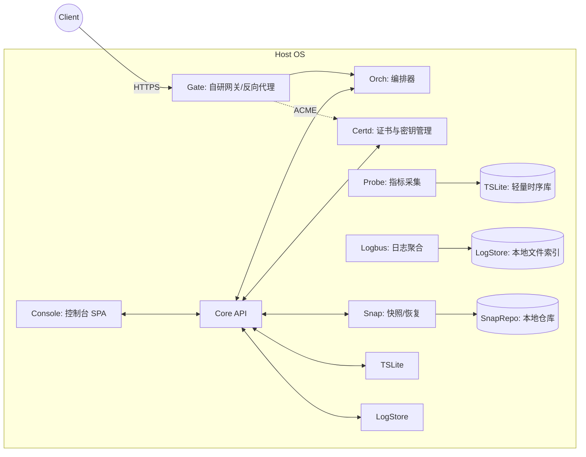

# 自研服务器“基座”PRD v1.0

> 目标：不依赖 Caddy/Traefik、Portainer、Prometheus/Grafana、restic 等现成产品，**自研一套可用的最小化基座**，覆盖：反向代理 + 自动 HTTPS、服务编排、可观测（指标/日志）、备份与恢复、安全基线与控制台。允许使用**少量开源库**（如 TLS/ACME 协议实现、系统指标读取）作为 SDK，而非直接拉现成框架/镜像。

---

## 1. 背景与成功标准

* 现有“基座”常以拼装现成组件为主，耦合度高、黑盒多。我们需要**可控、可裁剪、可学习**的自研底座，服务将长期在个人/小团队环境演进。

**MVP 成功指标（S.M.A.R.T.）**

* 15 分钟内完成“Hello 服务”上线并通过自研网关取得有效 HTTPS 证书（Let’s Encrypt，HTTP-01）。
* 从创建新服务描述（YAML）到上线可用：≤ 5 分钟（不含 DNS 生效）。
* 控制台可实时查看：主机 CPU/内存/磁盘/网络、各服务 CPU/内存与重启次数；指标刷新间隔 ≤ 5s。
* 每日自动生成一次**增量快照**（本地），保留策略生效；一条命令在 15 分钟内完成“从快照恢复 + 启动验证”。
* 对外默认仅暴露 80/443/22；其余服务经网关内网转发。

---

## 2. 核心能力与范围（Scope）

### In Scope（MVP）

1. **自研反向代理 + 证书自动化（模块名：Gate）**

   * L7 反代（HTTP/1.1 & HTTP/2）与基于主机名/路径的路由。
   * ACME 客户端（HTTP-01）自动签发/续期；证书缓存与热加载。
   * 安全默认：HSTS、HTTPS 强制跳转、基础安全 Header、限速（可选）。

2. **自研服务编排器（Orch）**

   * 以 YAML 描述服务（镜像/命令/端口/卷/健康检查/依赖）。
   * 后端基于 **containerd / runc** 或直接 **Linux namespace + cgroups v2**（MVP 允许选择 containerd API 以缩短周期）。
   * 生命周期：create→start→stop→restart；健康检查失败触发重启/告警。

3. **可观测性（Observer + Logbus）**

   * 自研 Agent（Probe）采集：主机（/proc）与服务（cgroups）指标。
   * 自研时间序列存储（轻量）：基于 SQLite + 压缩列（时间、指标、标签），或简单按时间片落盘（MVP 采用 SQLite WAL）。
   * 自研控制台（Console）内嵌图表（ECharts/Chart.js）展示；提供查询 API（PromQL 不纳入，使用自定义简化查询）。
   * 日志聚合（Logbus）：收集服务 STDOUT/STDERR，存本地文件并可按时间/服务查询；支持关键词筛选与下载。

4. **备份与恢复（Snap）**

   * 支持对指定数据目录/卷做**基于硬链接 + 哈希去重**的“类增量”快照（ZFS/Btrfs 不强依赖）。
   * 计划任务：每日/每周策略；保留规则：keep-daily 7、keep-weekly 4、keep-monthly 3。
   * 恢复脚本：允许恢复到新路径并以“影子实例”方式启动验证。

5. **安全基线（IAM + Policy）**

   * 控制台账号体系（本地用户 + TOTP 2FA 可选）。
   * SSH 基线检查器（脚本）：禁用 root 直登/密码登录、开放端口检查、网关策略校验。
   * 网关访问控制：基于主机名/路径的 allow/deny、基本速率限制。

6. **单页控制台（Console）**

   * 统一操作面板：路由与证书状态、服务编排/日志/指标、备份计划与快照列表、系统健康总览。

### Out of Scope（MVP 之外）

* Kubernetes、GitOps、SSO（Keycloak）、全量日志搜索引擎（Loki/ELK）、分布式时序数据库、远端对象存储。可在 M1/M2 路线图追加。

---

## 3. 角色与用户旅程

* **平台管理员**：创建服务描述→提交→Orch 拉起→Gate 绑定域名→Console 验证→配置备份计划。
* **开发者**：查看部署状态/日志/指标，拉取影子实例做回归验证。

**关键用户故事**

1. 作为管理员，我能在 Console 新建域名 `app.example.com`，绑定服务 `app`，并自动获得/续期证书。
2. 作为管理员，我能用一份简洁 YAML 声明服务，点击部署后 1 分钟内看到容器启动日志与健康状态。
3. 作为管理员，我能在 Console 看到 CPU/内存/磁盘/网络与每个服务的资源曲线，并按时间检索。
4. 作为管理员，我能每天看到增量快照列表，选择某个快照一键恢复到 `/srv/restore/app-<ts>` 并以影子端口启动。

---

## 4. 体系结构与模块边界



**技术栈建议**

* 语言：**Go**（网络、并发、跨平台、单静态文件易部署）。
* 前端：**React + Vite + Tailwind + shadcn/ui**（SPA），图表 **ECharts**。
* 存储：**SQLite (WAL)**（配置/账户/TSLite 与索引），文件系统用于仓库/日志/快照。
* 容器：优先 **containerd** 的 Go SDK；MVP 允许 `docker socket` 兼容层，但不要求安装 Docker CLI。

---

## 5. 详细功能需求（FRD）

### 5.1 Gate（自研反向代理 + TLS）

* **FR-G1** 路由：支持 `Host` 匹配与 `PathPrefix`，上游为 `127.0.0.1:<port>`（Orch 分配）。
* **FR-G2** TLS：内置 ACME 客户端（支持 HTTP-01 校验），证书/私钥持久化（SQLite + 文件）；自动续期阈值 30 天；热加载。
* **FR-G3** 安全：HSTS、强制 HTTPS 跳转、可配置安全头；可选简单速率限制（token bucket）。
* **FR-G4** 可观测：暴露 `/gate/metrics`（网关 QPS、4xx/5xx、上游延迟分位）。
* **FR-G5** 配置接口：CRUD 域名、路由、证书查看；失败重试/回退策略。

### 5.2 Orch（服务编排器）

* **FR-O1** 服务描述：

```yaml
name: app
image: ghcr.io/you/app:1.0
cmd: ["/app"]
env: { NODE_ENV: production }
ports:
  - internal: 8080   # 仅内网监听
healthcheck:
  http: http://127.0.0.1:8080/health
  interval: 5s
volumes:
  - host: /srv/data/app
    container: /data
restart_policy: on-failure:3
```

* **FR-O2** 生命周期 API：create/start/stop/restart/inspect/logs。
* **FR-O3** 健康检查：失败 N 次触发重启；上报状态给 Console。
* **FR-O4** 资源限制：CPU/内存限额（cgroups v2）。
* **FR-O5** 日志：将容器 stdout/stderr 转发到 Logbus。

### 5.3 Observer/Probe（指标）

* **FR-Obs1** 主机：CPU 利用率、Load、Mem、Swap、Disk（使用率/IOPS/吞吐）、Net（bps/pps）。
* **FR-Obs2** 服务：容器 CPU/内存/重启次数/网络/磁盘读写（从 cgroups + /proc/fs/cgroup 收集）。
* **FR-Obs3** 存储：写入 TSLite（SQLite），提供时间窗查询 API，支持 downsample（1s→5s→1m）。
* **FR-Obs4** 仪表板：Console 显示实时与历史曲线，Top N 容器资源排行。

### 5.4 Logbus（日志）

* **FR-L1** 输入：收集 stdout/stderr；按服务/日期滚动分片（如 `logs/<svc>/<YYYYMMDD>.log`）。
* **FR-L2** 索引：SQLite 记录文件偏移量与时间范围，支持区间检索与关键词匹配。
* **FR-L3** 导出：按时间窗口下载片段；Console 支持流式查看与暂停。

### 5.5 Snap（备份/恢复）

* **FR-S1** 快照：对声明的目录做块级去重（固定块 4MB）+ 哈希索引（SHA-256），落地为硬链接树；支持并行与限速。
* **FR-S2** 策略：cron 表达式；保留策略 `keep-daily/weekly/monthly`；自动清理孤儿块。
* **FR-S3** 恢复：可恢复到新路径；生成影子 Compose/Orch 描述，启动影子实例占用不同端口。
* **FR-S4** 校验：周期 `scrub`，随机抽样比对校验和；失败上报告警。

### 5.6 IAM + Policy（安全基线）

* **FR-A1** 本地用户（用户名/密码 hash/Bcrypt）、API Token、可选 TOTP。
* **FR-A2** 权限：管理员/只读观察者。
* **FR-A3** SSH 基线扫描脚本：对 `/etc/ssh/sshd_config`、`ufw`/`firewalld`、监听端口进行检查，给出修复建议。

### 5.7 Console（控制台）

* **FR-C1** 导航：总览（主机概况/告警）、服务、网关、证书、日志、备份、设置。
* **FR-C2** 服务：列表、状态、资源曲线、YAML 在线编辑/回滚、日志查看。
* **FR-C3** 网关：域名/路由配置、证书状态与手动续期；错误率 4xx/5xx 迷你图。
* **FR-C4** 备份：计划与历史快照、影子恢复向导。

---

## 6. 接口设计（选摘）

* `POST /api/services`：提交 YAML，返回 `service_id`。
* `POST /api/services/{id}/deploy`：部署/更新（rolling：先新后旧切换）。
* `GET /api/services/{id}/metrics?from=&to=&step=`：返回时序数组。
* `GET /api/logs/{id}/stream?since=`：SSE 实时日志。
* `POST /api/gate/routes`：新增域名与上游绑定。
* `POST /api/certd/issue`：触发 ACME 申请。
* `POST /api/snap/plan` / `POST /api/snap/restore`。

**事件总线（Server-Sent Events / WebSocket）**

* `service.status.changed`、`deploy.finished`、`cert.expiring`、`snap.done`、`alert.triggered`。

---

## 7. 数据模型（概览）

* `users(id, name, passhash, role, totp_secret, created_at)`
* `services(id, name, yaml, version, created_at, updated_at)`
* `deployments(id, service_id, version, status, started_at, finished_at)`
* `routes(id, host, path_prefix, upstream_service_id, tls_cert_id)`
* `certs(id, domain, not_before, not_after, key_path, cert_path, status)`
* `metrics(time, scope_type, scope_id, name, value)`  // TSLite 分表或列式化
* `logs_index(service_id, file, start_ts, end_ts, offset_start, offset_end)`
* `snapshots(id, plan_id, ts, manifest_path, size, kind)`
* `snap_plans(id, name, cron, paths[], keep_daily, keep_weekly, keep_monthly)`

---

## 8. 目录结构（仓库建议）

```
infra-core/
  cmd/
    gate/         # 反向代理二进制
    orch/         # 编排器二进制
    console/      # 控制台后端 API
    probe/        # 指标采集器
    snap/         # 备份/恢复工具
  pkg/
    acme/
    tls/
    router/
    orch/
    metrics/
    tsdb/
    logbus/
    snap/
    auth/
    config/
  ui/             # React SPA（Vite）
  scripts/
    harden-ssh.sh
    install.service.sh
  deploy/
    examples/
      hello.yaml
  docs/
    api.md
    ops.md
  Makefile
  .env.example
```

---

## 9. 非功能需求（NFR）

* **性能**：网关 p50 额外延迟 < 2ms（本机转发）；指标采集 CPU 占用 < 3%。
* **可用性**：组件崩溃自动拉起（systemd service）；配置热更新；TSLite 支持按月分表与过期清理。
* **安全**：密钥与证书权限 600；API Token 带过期；审计日志记录敏感配置更改。
* **可维护性**：所有配置集中在 `config.yaml` 与环境变量；单命令打包（`make build`）产出多二进制 + 前端静态资源。

---

## 10. 里程碑与排期（建议 3\~4 周）

* **W1**：Gate（HTTP 反代 + ACME HTTP-01 + 证书缓存 + HTTPS 跳转）；Console 登录框架与路由管理页。
* **W2**：Orch（YAML → 容器生命周期 + 健康检查 + 资源限额）；Probe（主机指标 v1）；Console 服务列表/状态/日志流式查看。
* **W3**：TSLite（SQLite WAL + 基本查询 + downsample）；Console 指标看板；Logbus（滚动+索引）；Snap（首个全量→增量快照 + 恢复到影子实例）。
* **W4**：安全基线工具、策略校验；回归与端到端验收；文档/脚本完善。

---

## 11. 验收清单（DoD）

* [ ] 通过 Gate 为 `hello.example.com` 自动签发 HTTPS 并可访问（证书链正确）。
* [ ] 通过 Orch 部署 `hello.yaml`，健康检查通过；崩溃后自动重启。
* [ ] Console 显示主机/服务指标，提供 1h/24h 时间窗切换；日志可按关键词检索。
* [ ] Snap 每日生成快照；可恢复并以影子端口启动验证。
* [ ] 安全基线检查通过：SSH/端口/网关策略/证书权限。

---

## 12. 风险与缓解

* **ACME 实现复杂**：采用成熟轻量库（如 `acmez`）但自行封装证书管理与网关集成；提供回退到自签证书模式。
* **容器接口选型**：MVP 先对接 containerd（或 Docker socket），后期替换为直接 runc；抽象 `Runtime` 接口降耦。
* **时序存储膨胀**：默认 15 天保留 + 下采样；提供离线归档脚本。
* **快照一致性**：对热数据支持 `fsfreeze` 或“先停写-快照-再放开”维护窗；提供 `pre/post` 钩子。
* **单机 SPOF**：提供配置与脚本以便后续横向扩展（Gate/Orch 可多实例 + VIP/Keepalived）。

---

## 13. Demo 场景（MVP 验收脚本）

1. `fsctl route add --host hello.example.com --upstream app:8080`
2. `fsctl service apply -f deploy/examples/hello.yaml && fsctl service logs -f hello`
3. 浏览 `https://hello.example.com`，Console 中查看指标与日志。
4. `fsctl snap plan add --name app-daily --paths /srv/data/app --keep-daily 7`；次日验证快照并 `fsctl snap restore --id <id> --target /srv/restore/app`
5. 运行 `scripts/harden-ssh.sh` 完成基线加固并在 Console -> Security 页看报告。

---

**版本**：v1.0（MVP，自研）
**命名建议**：Infra-Core（Gate/Orch/Console/Probe/Logbus/Snap/Certd）
**后续路线**：M1 引入外部远端仓库（S3/SSH）与消息告警；M2 增加多机协同与蓝绿/金丝雀发布。
